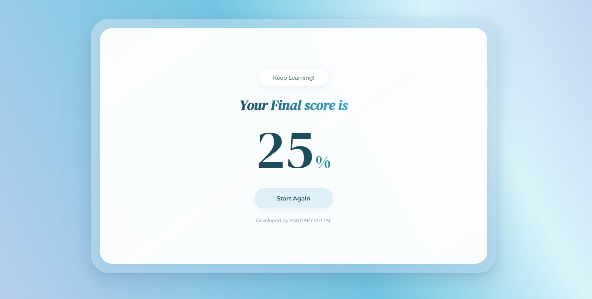

# Wedding Company — Frontend Assignment

This repository contains the frontend for the Wedding Company assignment completed as a
Frontend Developer Intern task.

**Candidate:** KARTIKEY MITTAL  
**RA Number:** RA2211028030017
**Deployed Link:** https://wedding-company-five.vercel.app/

**Assignment:** Frontend Developer Intern - Assignment for Wedding Company

**Figma Design:** https://www.figma.com/design/MHt6QPdmr1lKvJYiLMA1Tx/Front-End-Dev.-Assignment?node-id=0-1&p=f&t=IfAGKLvTQCCLB872-0

**Preview Screenshots**

**Tech Stack Used**
- **Framework:** React (Vite + TypeScript)
- **Build Tool:** Vite
- **Language:** TypeScript
- **Styling:** CSS (project uses `App.css` / `index.css`)
- **Tooling:** ESLint, TypeScript configs (`tsconfig.json`)

**Key Features Implemented**
- **Responsive UI:** Layout and components adapt for common screen sizes.
- **Static Content Pages:** Landing / main quiz pages implemented as per Figma.
- **Routing-ready Structure:** App entry in `src/main.tsx` and modular components in `src/`.
- **Asset Management:** Screenshots and images placed under `src/assets/` and referenced from README.

Getting started

1. Install dependencies:

   `npm install`

2. Run the dev server:

   `npm run dev`

Notes
- If the preview images do not display, make sure `initialscreen.png` and `finalscreen.png` are placed in `src/assets/`.
- This README highlights the implemented frontend parts of the assignment and provides the Figma design link for reference.

If you want, I can: commit these changes, push to the remote, or add the actual image files to `src/assets/` now.
